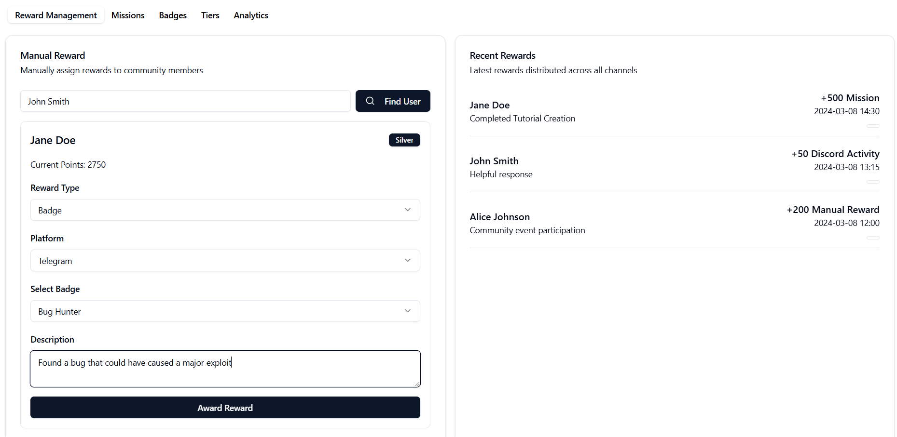
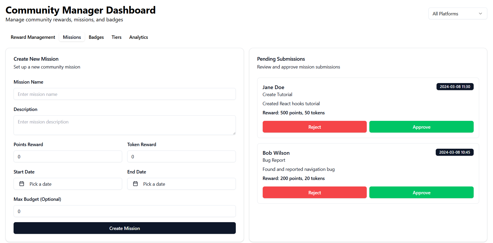
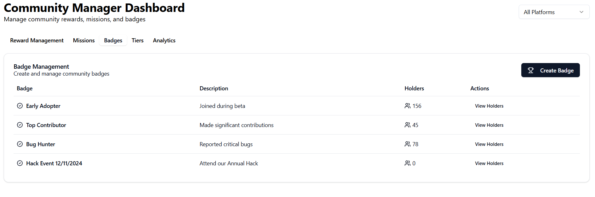
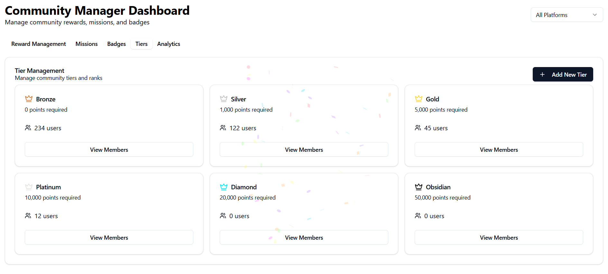
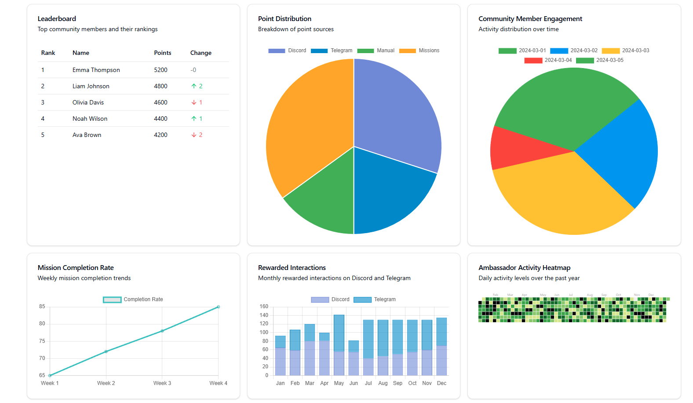

# Community Manager Dashboard

A UI for a dashboard for managing community engagement, rewards, and analytics. This dashboard helps community managers track and distribute rewards, manage missions, and monitor community loyalty metrics. Plus confetti! 🎉🎉

🔗 [Live Demo](https://community-manager-dashboard.replit.app/) (Note: May take a few seconds to load as it's hosted on Replit)

## Features

### 🏆 Reward Management
- Manual reward distribution for community members
- Support for multiple reward types (Points, Badges, Tokens, Discord roles)
- Platform-specific rewards (Discord, Telegram, GitHub)
- Real-time reward feed

### 🎯 Mission Management
- Create and manage community missions
- Set mission parameters (points, tokens, deadlines)
- Review and approve mission submissions
- Track mission completion rates

### 🏅 Badge System
- Create and manage achievement badges
- Track badge holders
- Custom badge descriptions and criteria
- Badge distribution analytics

### 👥 Tier System
- Manage community membership tiers
- Set tier requirements and benefits
- Track member progression
- Customizable tier colors and names

### 📊 Analytics
- Community engagement metrics
- Reward distribution analytics
- Mission completion rates
- Ambassador activity heatmap
- Leaderboard tracking

## What next?

This was just a quick UI mockup to test the concept of a community manager dashboard, if you would like to see this come to life please let me know at [dan@openformat.tech](mailto:dan@openformat.tech)!
